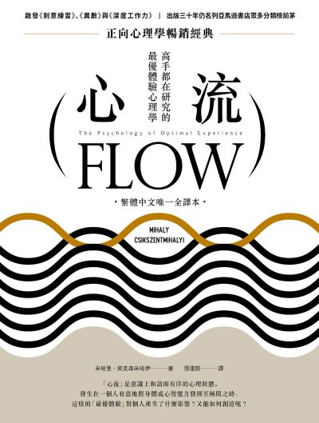

+++
title = '心流'
date = 2024-01-30
draft = false
tags = ["心流", "米哈里．契克森米哈伊"]
categories = ["閱讀筆記"]

description = "深入探討米哈里．契克森米哈伊的《心流：最優體驗心理學》。透過讀書筆記，解析如何透過挑戰與技能的平衡，掌控意識，在工作與生活中創造「最優體驗」與真正的幸福感。"
keywords = ["心流", "Flow", "米哈里", "契克森米哈伊", "最優體驗", "心理學", "讀書筆記", "幸福", "專注", "自我成長"]

featureImage = "featureImage.jpg"
featureImageDescription = "心流書本封面"
slug = "flow"
+++

# 《心流：最優體驗心理學》讀書筆記：掌控意識，重塑生活的幸福感

在這個物質生活飛速進步，但焦慮與空虛感卻日益蔓延的時代，我們該如何定義幸福？

米哈里．契克森米哈伊（Mihaly Csikszentmihalyi）在《心流：最優體驗心理學》一書中給出了一個反直覺的答案：幸福與外在條件無關，而是取決於我們如何詮釋它。這是我在閱讀本書後，關於如何掌控意識、創造「最優體驗」的深度筆記。

## 1. 重新詮釋幸福與成功

許多人終其一生追求外在的成功標籤，卻往往在達到目標後感到失落。奧地利心理學家維克多．弗蘭克（Viktor Frankl）曾說過一句極具啟發性的話：

> 「不要以成功為目標——當你越是針對它，以它為標的，就越容易錯過它。成功，就像幸福一樣，不是追求而來的；它是一個人全心全意投入一件事，而忘卻自我的副產物。」

這正是「心流」（Flow）的核心概念。最美好的時刻，並非發生在放鬆休閒時，而是發生在一個人有意地將身體或心智能力發揮到極限，去完成某件有難度或有價值的事。

在此過程中，我們會進入一種全神貫注、渾然忘我的境界。要達到這種境界，我們必須將全部的精神能量投注在一個「符合現實」的目標上，且自身的技能必須與行動相互配合。

## 2. 解析意識：資訊的秩序

意識並無神秘之處，它是生理作用的產物。我們可以將意識視為「經過刻意整理的資訊」。

* **意識的力量：** 人類的神經系統可以左右自己的狀態。不管外在環境如何，只要改變意識內容（轉念），就能改變快樂或痛苦的感受。
* **意圖（Intent）：** 這是讓意識維持秩序的力量。它像磁場一樣，將我們的注意力導向特定事物。
* **注意力的循環：** 注意力塑造了自我（例如：偶然注意到海洋之美），而自我反過來塑造注意力（開始刻意追求海洋生物學知識）。

處於最優體驗的人，會感到與目標一致的資訊不斷進入意識，精神能量源源不絕，不再自我懷疑。

## 3. 享樂 vs. 樂趣：生活品質的關鍵

改善生活品質有兩個策略：一是改變外在環境，二是改變體驗環境的方式。而後者往往更為關鍵，因為生活品質取決於我們如何看待自己與際遇。

我們必須區分「享樂」與「樂趣」：

* **享樂 (Pleasure)：** 是一種生物需求或社會制約的滿足（如：吃大餐、看電視放鬆）。它能維持秩序，但無法創造新秩序。
* **樂趣 (Enjoyment)：** 超乎原有的期待，具有向前發展的特性。它通常發生在從事一件艱難但有機會成功的事，能帶來新鮮感與成就感。

### 樂趣的八大要素

當活動具備以下特質時，最容易產生樂趣：

1. 從事一件艱難，但有機會成功的事（行動機會與個人能力相當）。
2. 必須全神貫注。
3. 有明確的目標。
4. 有立即的回饋。
5. 全心投入，忘卻平時的擔憂。
6. 覺得對自己的行動有掌控權。
7. 進入忘我境界（體驗結束後，自我感會更強烈）。
8. 時間感扭曲（幾小時像幾分鐘，或反之）。

這就是所謂的「自成目標」（Autotelic）活動——活動本身即是目標，而非為了未來的某種獎賞。

## 4. 心流的觸發機制：挑戰與技能的黃金比例

心流之所以能讓人感到成長，是因為它迫使我們進入一個新的現實，使自我變得更複雜。觸發心流最關鍵的條件在於 **「技能」與「挑戰」的匹配**：

* **A2 技能 > 挑戰：** 感到無聊（Boredom）。
* **A3 挑戰 > 技能：** 感到焦慮（Anxiety）。
* **A1、A4 技能 = 挑戰：** 進入心流（Flow）。

當我們在活動中感到無聊，意味著我們該提高難度；感到焦慮，則意味著需要提升技能。這種動態平衡推動著我們不斷進步。

## 5. 培養「自得其樂」的性格

除了尋找適合的活動，培養一種能隨時重組意識的內在性格同樣重要。哲學家羅素（Bertrand Russell）曾描述這種狀態：

> 「我學著無視自己的缺陷與存在；慢慢增加對外在事物的關注，像是世界的現狀、各種領域的知識、令我感興趣的人物。」

### 家庭對心流能力的影響

研究發現，在「自成目標」家庭長大的孩子，更容易產生心流體驗。這樣的家庭具備五個特點：

1. **明確 (Clarity)：** 孩子清楚知道父母的期待與回饋。
2. **重心 (Centering)：** 父母對孩子當下做的事感興趣，而非只關心未來的功利結果。
3. **選擇 (Choice)：** 孩子感覺自己擁有選擇權，並願承擔後果。
4. **承諾 (Commitment)：** 足夠的信任感讓孩子能放下防備，全心投入。
5. **挑戰 (Challenge)：** 父母提供複雜度逐漸提高的行動機會。

## 6. 翻轉渾沌：將壓力轉化為力量

為什麼有些人遇到壓力會崩潰，有些人卻越挫越勇？關鍵在於是否具備將無助狀況轉換為可控心流活動的能力。

這類人通常具備以下特質：

* **不自覺的自信：** 不堅持自己的目標非得凌駕一切，而是將自己視為環境的一部分，在此體系中盡責。這種謙卑的自信是強者的標誌。
* **焦點向外：** 態度開放，保持客觀，不花時間自怨自艾，而是注意到環境中的可能性。
* **尋找解決之道：** 聚焦於移除障礙，甚至調整目標以尋求和諧。

## 7. 結語：創造意義

想要將生活的全部變成一場心流體驗，光懂得控制一時的意識狀態是不夠的。我們需要一個貫穿人生的整體目標。

心流理論的最終任務，是在所做的每一件事上創造和諧。只要方向清楚，行動規則明確，並能讓我們專注投入，任何目標——無論大小——都能讓人的一生充滿意義，將人生整合成單一件宏大的心流活動。

---
