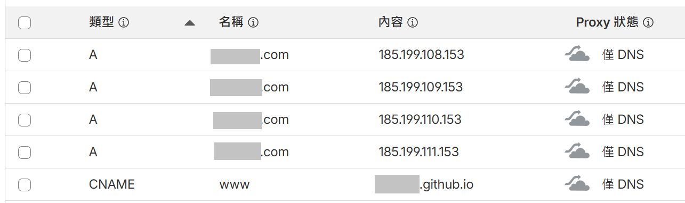

---
title: "從零開始 : Hugo + GitHub Pages + Cloudflare 架站筆記"
draft: true
date: 2026-01-10T15:45:00+08:00
tags:
  - hugo
  - blowfish
  - github-pages
  - cloudflare
  - static-site
categories:
  - 技術筆記  
description: "完整收錄從環境建置到網域綁定的實戰筆記。本篇指南涵蓋 Hugo 安裝、Blowfish 主題配置、GitHub Actions 自動化部署腳本，以及最關鍵的 Cloudflare DNS 與 CNAME 設定避坑指南。"
keywords: "hugo, blowfish, github-pages, cloudflare, automation, powershell"
featureImage: "cover.jpg"
featureImageDescription: "A futuristic digital workspace featuring a holographic structure of a website being built from code blocks. The central block glows with the Hugo logo, connected by light streams to a GitHub logo and a Cloudflare shield. The background is a deep tech blue with subtle binary code rain."
slug: "hugo-blowfish-github-pages-guide"
---


這篇筆記整理了使用 [Hugo](https://gohugo.io/)（靜態網站生成器）搭配 [Blowfish](https://blowfish.page/zh-cn/)主題，管於 [GitHub Pages](https://docs.github.com/en/pages)，並在[Cloudflare](https://www.cloudflare.com/zh-tw/)設定網域。

---

## 準備

### 安裝 Node.js
**Node.js:** 前往 [Node.js 官網](https://nodejs.org/en/download) 下載並安裝。


### 安裝 Hugo
**Hugo (Windows):** [install Hugo](https://gohugo.io/installation/windows/#winget)

```
winget install Hugo.Hugo.Extended
```


### 安裝Blowfish工具
使用官方推薦的 CLI 工具來初始化主題，這能簡化很多依賴設定。

> **提示**：詳細步驟可參考 [Blowfish 官方文檔](https://blowfish.page/zh-cn/docs/installation/#使用-blowfish-tools-工具安装-推荐)。

---

## 配置
### Blowfish基礎配置

[開始](https://blowfish.page/zh-cn/docs/getting-started/)

[配置](https://blowfish.page/zh-cn/docs/configuration/)


### 站點級配置 (hugo.toml)
* `baseURL`: **最關鍵的參數**。
    > `baseURL` 必須被設置為最終的公開域名（例如 `https://www.example.com/`）。如果設置錯誤，部署後會導致 CSS/JS 路徑失效，網站變成「裸奔」狀態（樣式丟失）甚至出現 404 錯誤。
* `languageCode`: 設置為 `zh-tw`，這有利於 SEO 與瀏覽器翻譯識別。

### 目錄結構解析

| 目錄名稱 | 功能描述 | 重要性 |
| :--- | :--- | :--- |
| **config/** | 存放配置文件 | 強烈建議拆分為多個檔案（如 `languages.zh-tw.toml`），以支持多語言配置。 |
| **content/** | 存放文章內容 | 網站的靈魂。資料夾結構直接對應網址路徑。 |
| **static/** | 存放靜態資源 | 這裡的檔案（如圖片、`CNAME`）會被原封不動複製到發布目錄。 |
| **assets/** | 資源處理 | 存放需要的檔案。 |

### 多語言與選單
在 `config/_default/languages.zh-tw.toml` 中定義網站標題與作者資訊；在 `menus.zh-tw.toml` 中定義導航欄。利用 `weight` 參數控制排序，數值越小越靠前。

---

## 自動化部署：GitHub Pages

不需要每次手動 build 完再上傳，讓 GitHub Actions 代勞，實現「推代碼即部署」。

### 建立 Workflow 檔案
[官方文件](https://blowfish.page/zh-cn/docs/hosting-deployment/#github-pages)<br>
請在專案根目錄建立檔案 `.github/workflows/gh-pages.yml`，並填入自動化部署的配置內容（定義 Build 與 Deploy 到 gh-pages 分支的流程）。

注意需加入 **jobs.build-deploy.permissions.contents : write** ，否則 Action 會因權限不足而失敗。
```yaml
# .github/workflows/gh-pages.yml

name: GitHub Pages

on:
  push:
    branches:
      - main

jobs:
  build-deploy:
    permissions:
      contents: write
    runs-on: ubuntu-24.04
    concurrency:
      group: ${{ github.workflow }}-${{ github.ref }}
    steps:
      - name: Checkout
        uses: actions/checkout@v3
        with:
          submodules: true
          fetch-depth: 0

      - name: Setup Hugo
        uses: peaceiris/actions-hugo@v2
        with:
          hugo-version: "latest"

      - name: Build
        run: hugo --minify

      - name: Deploy
        uses: peaceiris/actions-gh-pages@v3
        if: ${{ github.ref == 'refs/heads/main' }}
        with:
          github_token: ${{ secrets.GITHUB_TOKEN }}
          publish_branch: gh-pages
          publish_dir: ./public
```

### .gitignore

為了保持 Git 倉庫乾淨，請設定忽略生成目錄與暫存檔。
```yaml
# Hugo default output directory
/public
/resources/_gen

# Hugo build lock
.hugo_build.lock

```

### 簡易版的自動提交腳本
為了節省每次輸入 git 指令的時間，用一個簡單的 PowerShell 腳本 (deploy.ps1)：

```ps1
param(
    [Parameter(Mandatory=$false)]
    [string]$msg = "Site update $(Get-Date -Format 'yyyy-MM-dd HH:mm')"
)

# 執行 git add
Write-Host "正在加入變更至暫存區 (git add)..." -ForegroundColor Cyan
git add .

# 檢查是否有變更需要提交
if ($(git status --porcelain)) {
    # 執行 git commit
    Write-Host "正在提交變更 (git commit)..." -ForegroundColor Cyan
    git commit -m "$msg"

    # 執行 git push
    Write-Host "正在推送至遠端 (git push)..." -ForegroundColor Cyan
    git push

    Write-Host "完成！" -ForegroundColor Green
} else {
    Write-Host "沒有偵測到需要提交的變更。" -ForegroundColor Yellow
}

```

### 設定 GitHub Pages 來源
將代碼推送到 GitHub 後，等待 Action 執行成功，接著必須手動啟用 Pages 服務：

1.  進入 GitHub Repo 的 **Settings**。
2.  點擊左側側邊欄的 **Pages**。
3.  在 **Build and deployment** 區域：
    * **Source**: 選擇 `Deploy from a branch`。
    * **Branch**: 選擇 `gh-pages` 分支 (如果沒看到，請確認 Action 是否已成功跑完)。
    * **Folder**: 選擇 `/ (root)`。
    * 點擊 **Save**。

---

## 網域綁定：Cloudflare 與 CNAME

### Cloudflare DNS 設定
購買網域後，使用 Cloudflare 來管理 DNS<br>
[Github教學](https://docs.github.com/en/pages/configuring-a-custom-domain-for-your-github-pages-site/managing-a-custom-domain-for-your-github-pages-site)<br>
* **Apex Domain (根域名 example.com):**
    新增 4 筆 `A` 記錄，指向 GitHub Pages 的專用 IP：
    * `185.199.108.153`
    * `185.199.109.153`
    * `185.199.110.153`
    * `185.199.111.153`    

* **Subdomain (子域名 www):**
    新增 1 筆 `CNAME` 記錄：
    * 名稱: `www`
    * 內容: `<你的GitHub用戶名>.github.io`



### 關鍵一步：手動建立 CNAME 文件
**這是一個極易被忽略！**
當你在 GitHub 網頁上設定 Custom Domain 後，GitHub 會自動產生一個 `CNAME` 檔。但因為我們的部署流程是「每次重新生成並覆蓋」，下一次 Hugo 部署時，這個檔案會被刪除，導致網域失效。

**解決方案：**
必須在本地專案的 `static/` 目錄下手動建立一個名為 `CNAME` 的檔案（無副檔名），內容只需一行，請填入你的網域，範例如下：

```
example.com
```

**原理：**Hugo 在構建時，會將 `static/` 目錄下的所有文件原封不動地複製到 `./public`。這確保了每次 Action 構建後，CNAME 文件都會存在，從而持久化網域綁定配置。

### GitHub Pages 設定
回到 GitHub Repo 的 **Settings > Pages > Custom domain**，填入你的網域（如 `example.com`），等待 "DNS check successful"。


## 總結與檢查清單
完成上述步驟後，你的網站應該已經順利上線了。最後，請對照這份清單進行最終確認：

**hugo.toml:** baseURL 是否已改為你的正式網域？

**static/CNAME:** 文件是否存在且內容正確？

**GitHub Settings:** Pages 頁面是否顯示 "DNS check successful"？